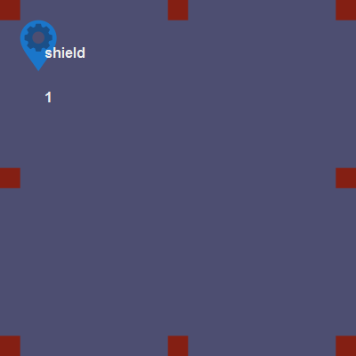

# EVE Space
## mkv25.net games

EVE Space is a clone of Carcassone themed around the game EVE online.

Instead of Cities, Roads, Farms and Monasteries; the game replaces these elements with Regions, Routes, Asteroids, and Planets.

## Tile Data

### Regional Command Center

- **Shield Zone**: Double points if controlling this tile as part of a region

### Central Regional Edge

