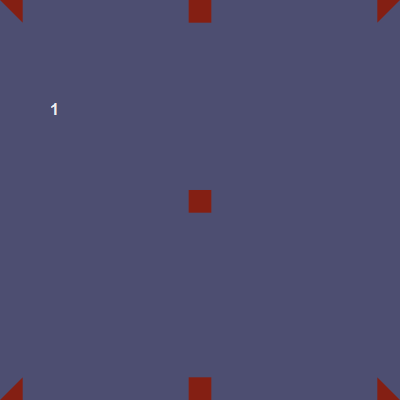
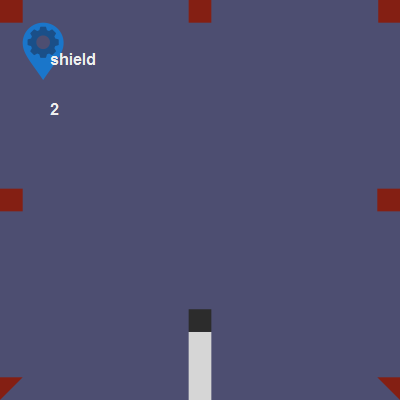
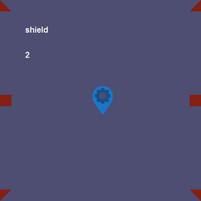
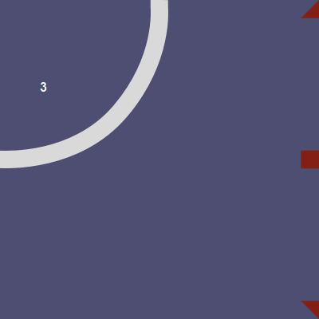
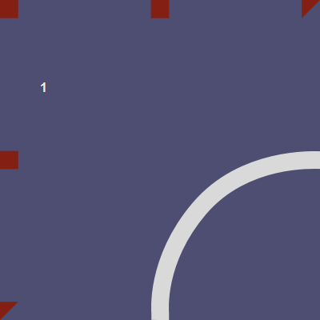
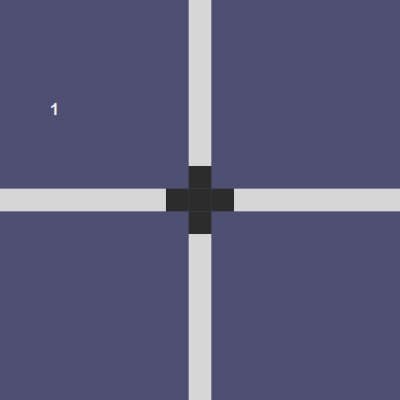
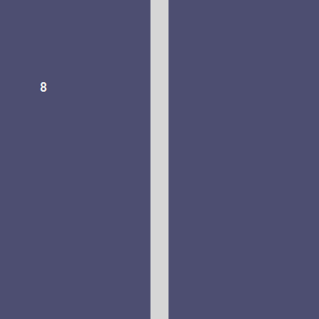

# EVE Space
## mkv25.net games

EVE Space is a clone of Carcassone themed around the game EVE online.

Instead of Cities, Roads, Farms and Monasteries; the game replaces these elements with Regions, Routes, Asteroids, and Planets.

## Game Tiles

### Regional Command Center

- **Shield Zone**: Double points if controlling this tile as part of a region

### Central Regional Edge

### Regional Corridor

### Regional Trade Hub

- **Shield Zone**: Double points if controlling this tile as part of a region

### Regional Corner

### Regional Gap

### Secure Regional Corner

- **Shield Zone**: Double points if controlling this tile as part of a region

### Regional Edge

### Planetary Control Zone

### Secure Regional Corridor

- **Shield Zone**: Double points if controlling this tile as part of a region

### Regional Trade Outpost

### Regional Tax Office

### Secure Regional Trade Corner

- **Shield Zone**: Double points if controlling this tile as part of a region

### Regional Trade Corner

### Regional Corner

### Secure Central Regional Edge

- **Shield Zone**: Double points if controlling this tile as part of a region

### Planetary Trade Control Zone

### Regional Trade Outpost

### Nullsec Trade Outpost

### Nullsec Trade Route

### Nullsec Trade Corner

### Nullsec Trade Outpost

### Regional Edge Trade Route

### Central Regional Trade Hub

